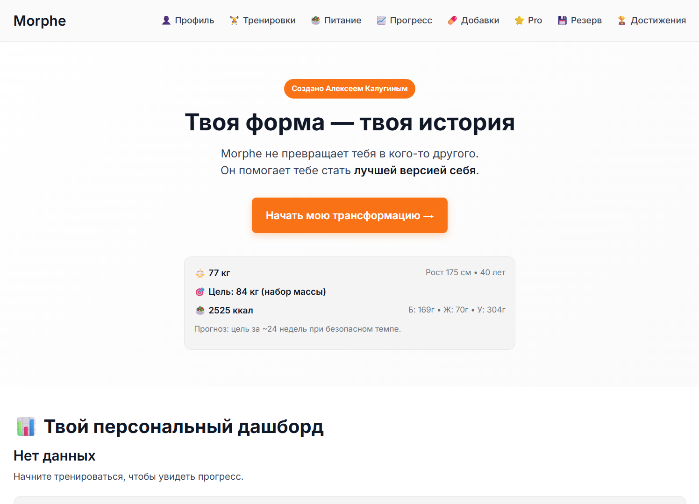

# Morphe — Умный фитнес-коуч без подписок

> 💪 Отслеживайте тренировки, питание и прогресс  
> 🌐 Работает оффлайн, как приложение  
> 🎯 Адаптивные программы и AI-советы  
> 🔓 Open Source • Нет рекламы • Без бэкенда  

👉 **Попробуйте онлайн:** https://morphe.vercel.app  
📥 **Добавьте на телефон** — это полноценное PWA!

---

## Особенности

✅ **Адаптивные программы тренировок**  
→ Под вашу цель, уровень и восстановление

✅ **AI-анализ питания**  
→ Советы в реальном времени: «Добавь овощей», «Пей воду»

✅ **Прогресс с графиками и фото до/после**  
→ Видите, как меняется тело

✅ **Работает оффлайн**  
→ Никакого интернета не нужно после первого запуска

✅ **Экспорт в CSV**  
→ Анализируйте данные в Excel

✅ **Open Source**  
→ Вы сами контролируете свои данные

---

## Как использовать

1. Откройте в браузере: [https://morphe-pwa.vercel.app/](https://morphe-pwa.vercel.app/)
2. Заполните профиль
3. Добавьте на экран (PWA):
   - **Android**: ⋮ → «Добавить на главный экран»
   - **iOS**: Поделиться → «На экран „Домой“»

---

## Технологии

- Vanilla JS (ES6+ Modules)
- Chart.js — графики
- Service Worker — оффлайн
- Web App Manifest — PWA
- localStorage — хранение данных

---

## Лицензия

MIT © Алексей Калугин  
Свободно используйте, модифицируйте, распространяйте.
